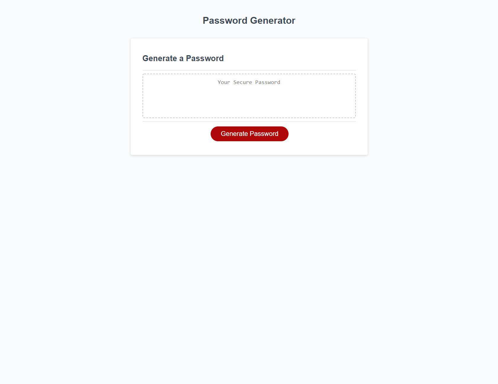

# Password Generator

The purpose of this site is to generate a random password tailored to the user's needs. There are options to choose from including password length and what kind of characters to include. The password is generated randomly using JavaScript and then displayed on the page.

## Link to Deployed Project

https://kmascott.github.io/password-generator/

## Screenshot

